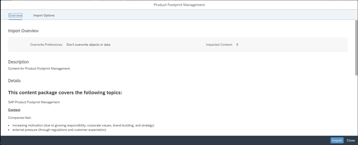
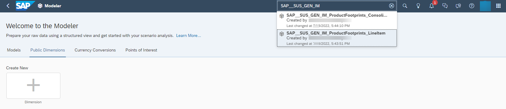

# **Context**

After the calculation is completed, you can view your footprint information within **SAP Analytics Cloud**, if you have a license for it. **SAP Analytics Cloud** offers Stories with Dashboards that contain analytical charts based on important KPIs. To know more about the integration with **SAP Analytics Cloud**, see [SAP Product Footprint Management](https://help.sap.com/docs/SAP_ANALYTICS_CLOUD/42093f14b43c485fbe3adbbe81eff6c8/fa7e9b7df6cf4b8b9b91ee051aaa4858.html?locale=en-US) on the SAP Help Portal.

# **Setting Up SAP Analytics Cloud**

1. Log in to your SAP Analytics Cloud tenant.
2. Navigate to Content Network -> Business Content option.

3. Search for the ***Product Footprint Management*** package name. Once you find it, go to the the **Import Options** tab and check if all objects are selected. Then, start the import.

The import can take a while. Wait for it to complete before starting the setup activities. Before you proceed to the next step, ensure that you have set up the analytics API and have your service key and other credentials necessary to connect to SAP Product Footprint Management. For details, see [Getting Started](https://help.sap.com/docs/SAP_ANALYTICS_CLOUD/42093f14b43c485fbe3adbbe81eff6c8/9974763fe4064a43a3b268257bb24e5b.html).

4. Navigate to the Connections tab on the left navigation pane. Search for the ***SAP__PFM_ProductsFootPrints_OData*** connection.

5. Select the connection and choose the **Edit** icon on top of the Connections list. The pop-up will consist of several fields, most of them pre-filled. Enter details for the other fields as described below.

|Task/Field Name  |Value  |
|---------|---------|
|Connection Name|Prefilled|
|Description|Prefilled|
|Connect to an SAP OData service|Unchecked by default. Leave as is.|
|Connect to an SAP OData service|Unchecked by default. Leave as is.|
|Data Service URL|Enter the OData service URL you have obtained from the BTP cockpit. when you created your service instance and service key for SAP product Footprint Management. For more information, see [Subscribing to the Application and Services](https://help.sap.com/docs/SAP_BTP_PFM/b3e39aed098c41a2b0d49db0caf80711/00025a1f827a41c5bb48fa8f5007c31c.html#subscribing-to-the-application-and-services). To retrieve the service URL, navigate to your subaccount, choose **Instances and Subscriptions**, then choose the instance for SAP Product Footprint Management. Choose the **View Credentials** button and retrieve the URL. To this URL, append the following after */api*: /footprintdata-analytics-service/v1/odata/v4/footprintdataanalytics/v1/.|
|Authentication Type     |OAuth 2.0 Client Credentials (pre-selected).         |
|OAuth Client ID     |Enter the client ID you have from the BTP cockpit. You can retrieve this information by using the same steps you followed for accessing the Data Service URL.         |
|Secret     |Enter the client secret you have from the BTP cockpit. You can retrieve this information by using the same steps you followed for accessing the Data Service URL.         |
|Token URL     |Enter the OAuth token URL. You can retrieve this information by using the same steps you followed for accessing the Data Service URL.         |
|Scope     |Empty by default. Leave as is.         |

6. Navigate to the **Modeler** tab from the left navigation pane and go to the **Public Dimension** tab. Search for the *SAP__SUS_GEN_ProductHierarchy* dimension.

7. Open the the dimension. You see the members of the dimension with their descriptions. On the top left of the screen, choose the **Workspace** dropdown and select **Data Management**.

8. When you switch to this view, you see that the sources are listed. Select each source and then click the **Refresh** icon to bring the latest data from the from SAP Product Footprint Management to this public dimension. This step may take some time depending on how many footprints you have. You can choose to be notified in the event that there are refresh failures as shown below.

9. Navigate to the **Modeler** tab from the left navigation pane. Search for the models that start with *SAP__SUS_GEN_IM*. The search shows two models – *ProductFootprints_Consolidated* and *ProductFootprints_LineItem*. 

10. Open the first model, go to **Workspace** -> **Data Management** and trigger a Data Refresh via Import Jobs. Repeat the process for the second model.

All models will now be refreshed with the latest calculations from the connected SAP product Footprint Management system. You can now use the default the stories and their dashboards in the Content Network for your footprint analyses.
