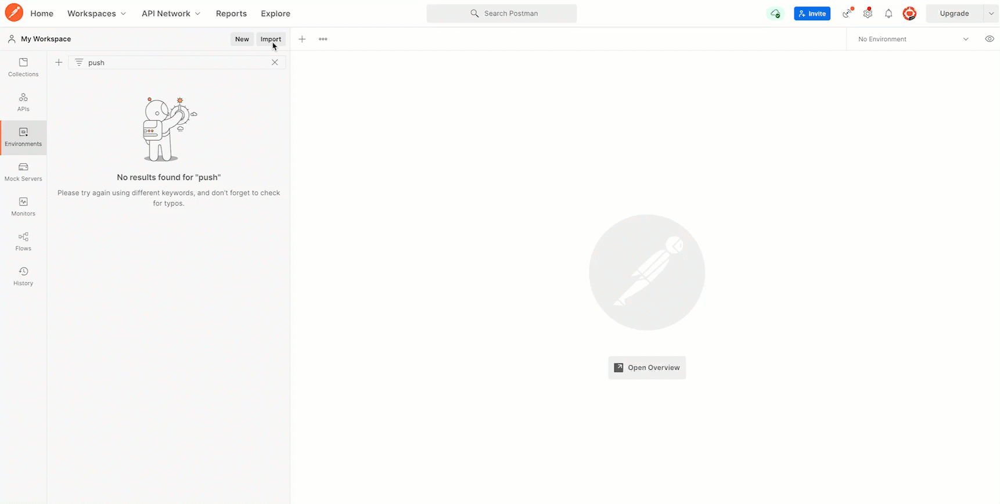
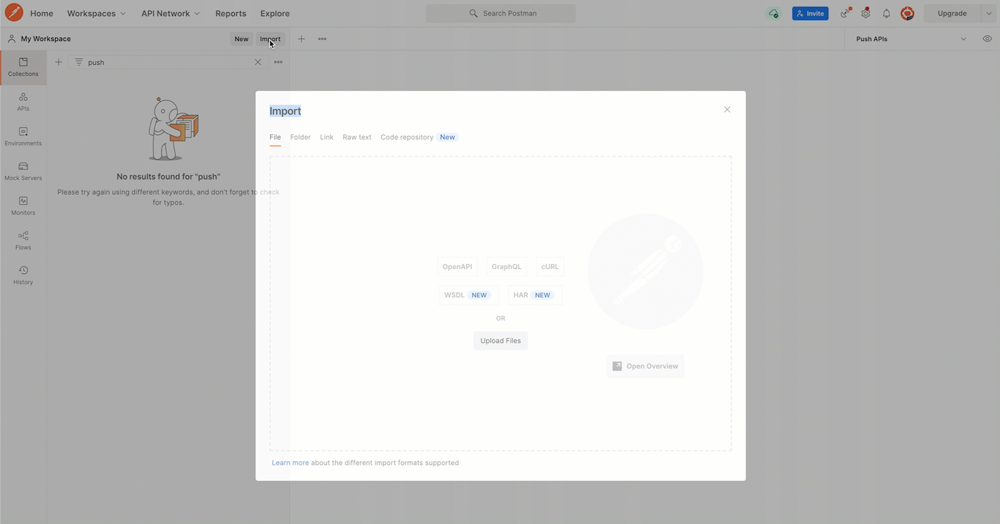
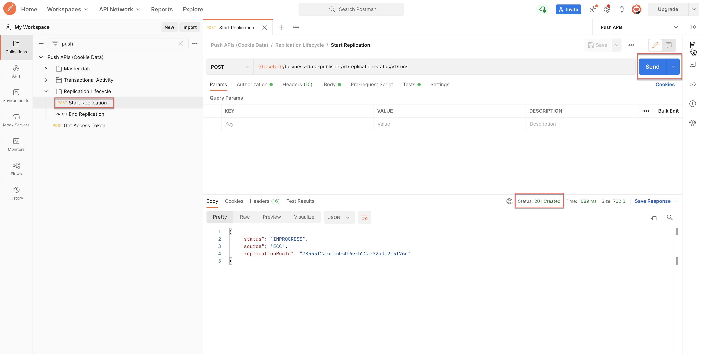
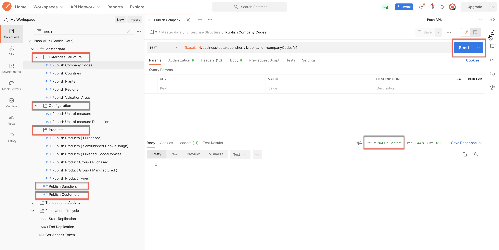
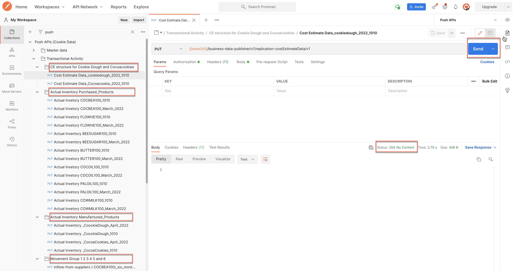
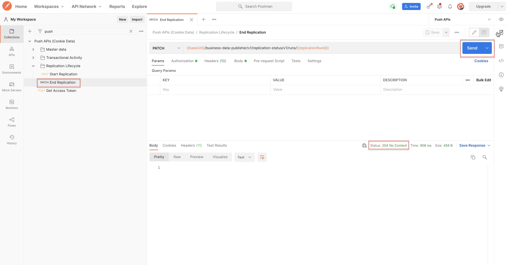

# **Instructions for Data Import**
## **Setting up the environment**

1.	Import the [Push APIs.postman_environment.json](./Push%20APIs.postman_environment.json) file by using your Postman client.

2.	Enter values for variables in the current value section of the environment from your serviceKey credentials. Your service key is that which you generated in your SAP BTP subaccount while setting up the SAP Product Footprint Management solution.

| Environment Variable Name        | ServiceKey Value           
| ------------- |:-------------
| clientId | uaa> clientid
| clientSecret| uaa> clientsecret
| authUrl | uaa> url
| baseUrl | endpoints> apihost

3.	Save the above properties.

## **Setting up the API collection**

Import the [Push APIs (Cookie Data).postman_collection.json](./Push%20APIs%20(Cookie%20Data).postman_collection.json) by using Postman.

## **Generating an access token**

Verify that the correct environment (Push APIs) is selected and proceed as follows.
1. Select the "Get Access Token" request from the collection.
2. Select the "Send" button.
3. Verify that the response status is **200 OK** and that the response body contains an access token.

*Note: The token is valid for an hour. If any subsequent requests return 401 or 403 then repeat the steps to regenerate the token and continue using the APIs.*

##  **Importing Data**

*Note: Verify that the correct environment (Push APIs) is selected.*
### **Triggering a replication run**

1. Select "Start Replication" request from the collection under "Replication Lifecycle" group.
2. Send the request.
3. Verify that the response status is _201 CREATED_ and the response body contains a **replicationRunId**.

###	**Importing master data**

1. Select requests under the "Master data" group from the collection and execute them in the following order.
    - Requests under Enterprise Structure.
    - Requests under Configuration.
    - Requests under Products. 
    - Publish Suppliers
    - Publish Customers.
2. Verify that the response status is _204 NO CONTENT_ for each of the requests.

### **Importing transactional data**

1. Select requests under the "Transactional Activity" group from the collection and execute them in the following order.
    - Movement Group 1 2 3 4 5 and 6.
    - Actual Inventory of Purchased_Products.
    - Actual Inventoryof Manufactured_Products.
    - CE structure for Cookie Dough and Cocoacookies.
2. Verify that the response status is _204 NO CONTENT_ for each of the requests.

### **Ending a replication run**

1. Select "End Replication" request from the collection under "Replication Lifecycle" group.
2. Send the request.
3. Verify that the response status is _204 NO CONTENT_.

