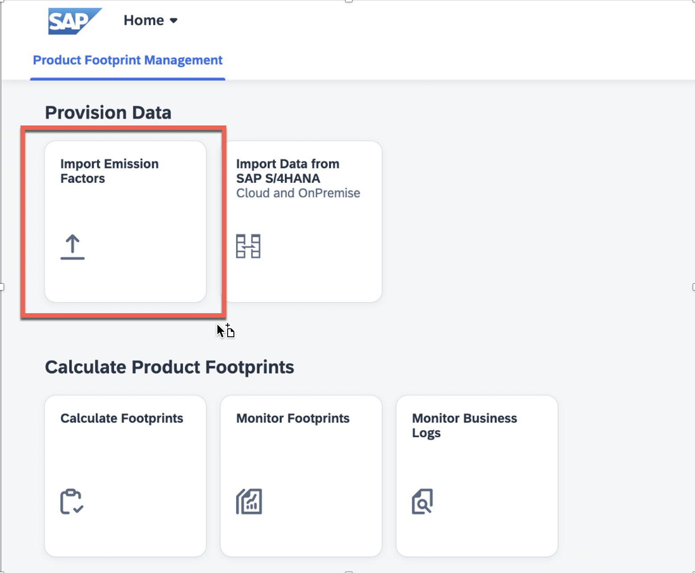
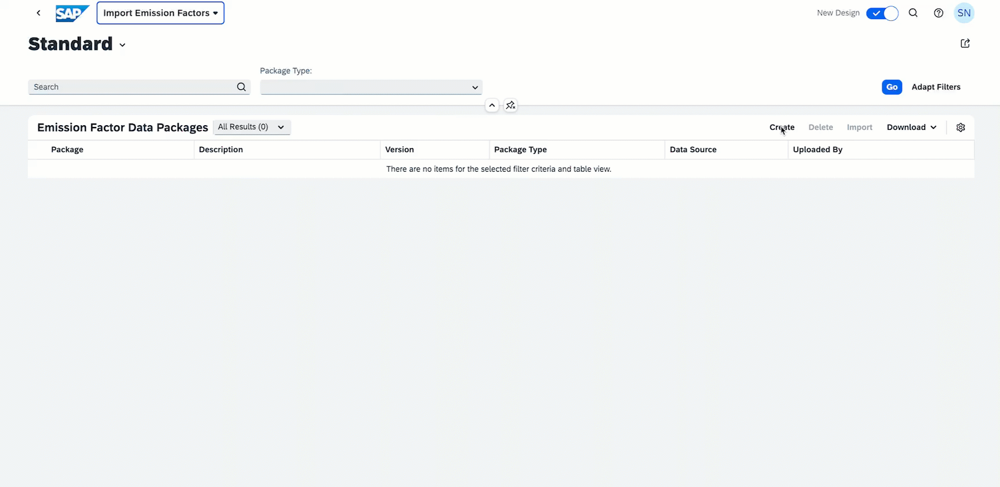
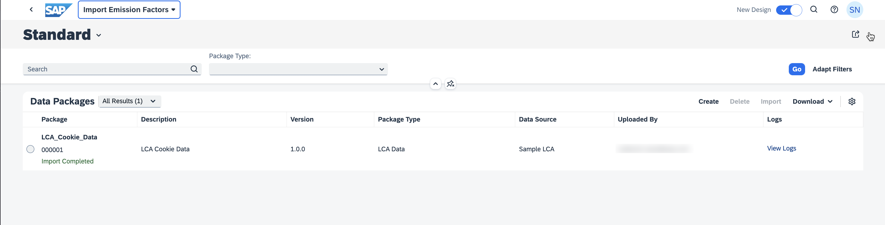
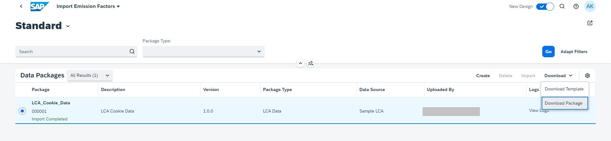

# **Instructions for Emission Factors Upload**

1. Go to the your SAP Fiori launchpad with SAP Product Footprint Management and select the **Import Emission Factors** application.

This will take you to the **Import Emission Factors** application where you can upload emission factors from your suppliers from an Life Cycle Asssessment provider.

2. Create an emission factor data package.
 - Select the create’ button as shown.
 - Enter the following information in the dialog box.
 
| Field        | Value           
| ------------- |:-------------
| Package Name | < A meaningful name >
| Description| < A meaningful description >
| Package Type | LCA Data
| Data Source | SAP
| Version | 1.0.0

*Note: Please ensure that there exists no other entry for the same combination of Name, Source and Version.*

- Select the Create button. 
- You should now see the package created with the status ‘No Data’.

3. Uploading an Emission Factor File.
- Select the content package created in the previous step and choose the Import button.
- In the resulting dialog box, choose the file [Sustainability Reference_Content.xlsx](./Sustainability%20Reference_Content.xlsx) and select Import.
- You should now see the corresponding package entry with the status ‘Importing...’.

**Note: The file may take a while to process. Once done, the status changes to 'Import Completed'.**

*Take note of the Package ID generated (000001 in this case). This same package ID must be used when you upload your files for purchased product calculations.*

**Note: You can also download the emission factors you uploaded by using the *Download* button as follows.**

