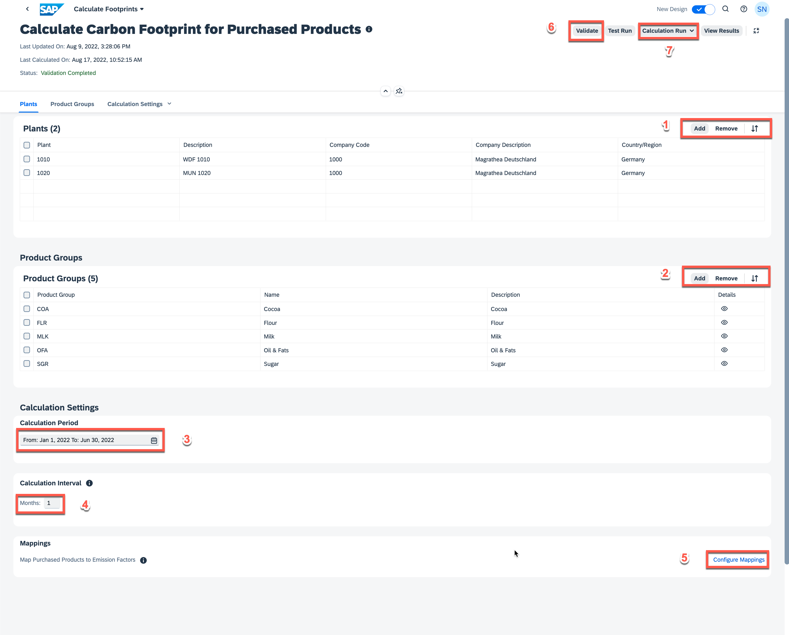

# **Starting a Calculation Run for Purchased Products**

Open the **Calculate Footprints** application from your dashboard and select the **Calculate Carbon Footprint for Purchased Products** template from the left navigation pane.

1. Under the **Plants** section, select the **Add** button and and choose the plants _1010_ and _1020_.
2. Under the **Product Groups** section, select the **Add** button and choose the following products:
    - COA
    - FLR
    - MLK
    - OFA
    - SGR
 
*Note: Do not add the product group COOKIE as it's a Manufactured Product.*

3. Set the **Calculation Period** to Jan 1, 2022 to Mar 31, 2022.
4. Set the **Calculation Interval** to 1.
5. Choose the **Configure Mappings** button under the _Mappings_ section. You will now be navigated to the page for mapping Emission Factors with Purchased Prodcuts.
    -  Select the **Upload Data** button.
    -  Choose the [Mappings-for-Purchased-Products.csv](./Mappings-for-Purchased-Products.csv) file and select the **Upload** button.
    
    **Note: Verify that the Package ID column in the .csv file has the same value that was generated while you uploaded the emission factor file.**
    -  The file will be processed in some time and the corresponding mapping entry will be listed.
    -  After the processing is complete, use the **Back to Calculation Template** button to come back to the previous screen.
 

6. Select the **Validate** button from the action buttons on the top row. 
    - Verify that the validation is successful. If it is, you will see a success message in the footer.
7. Select **Calculation Run** and choose the **Full Run**.
    This may take a while; the progress bar will indicate the status of calculation.

*Note: When you calculate footprints with your actual data, ensure that you first use the Validate button to validate your data and then do a Test Run to view any errors and fix them. Doing so will simplify the calcuation run and result in fewer errors.*
