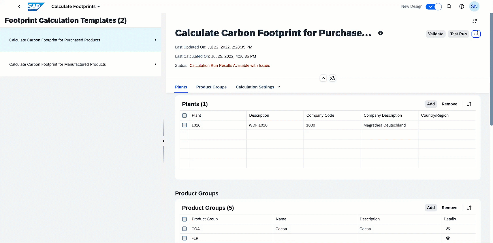
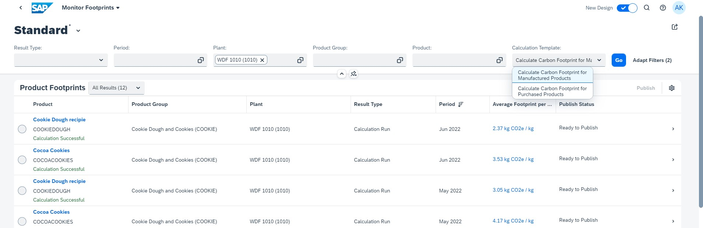
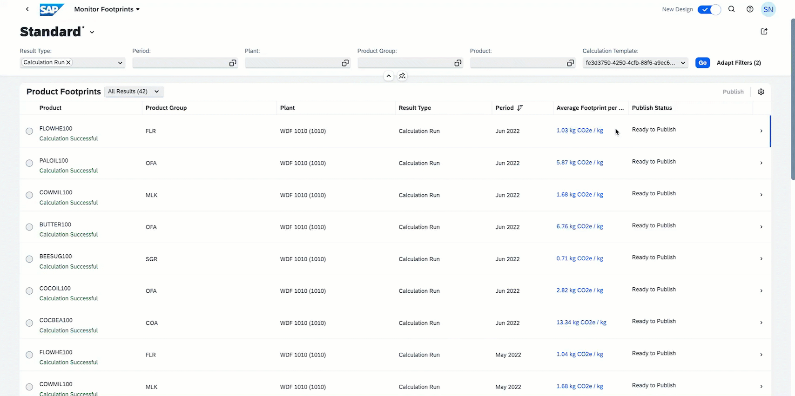

# **Viewing the Results of a Calculation Run**

After the calculation is completed, the results can be viewed in the **Monitor Footprints** application.

1. Select the **View Results** button. This directs you to the **Monitor Footprints** application.

**Note: This application can also be accessed directly from the SAP Product Footprint Management launchpad.**

You can also filter your results to check for specific types of footprint calculations such as purchased or manufactured products as follows.

2. Navigate to a footprint to see its breakdown. 

3. For more information, you can use the in-application help as shown.

